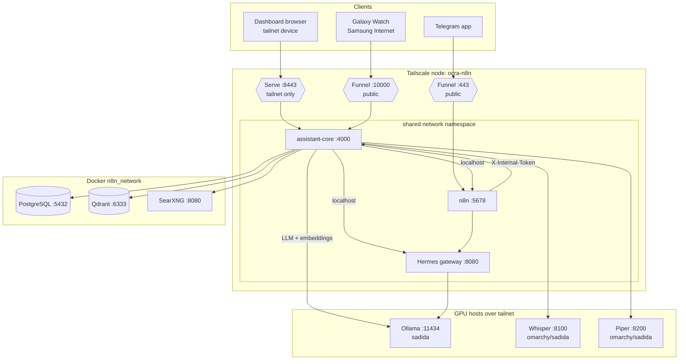
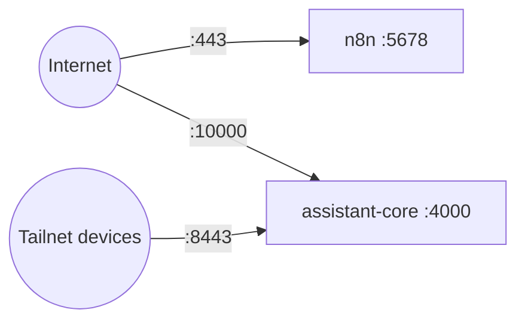
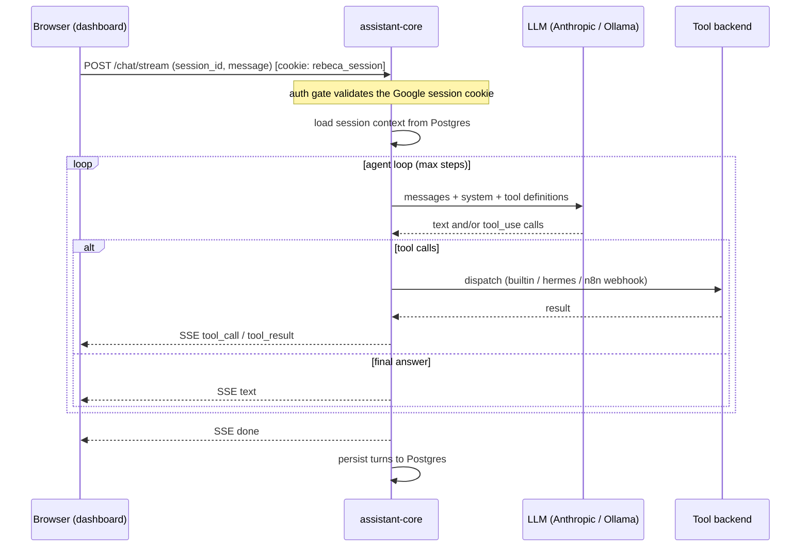
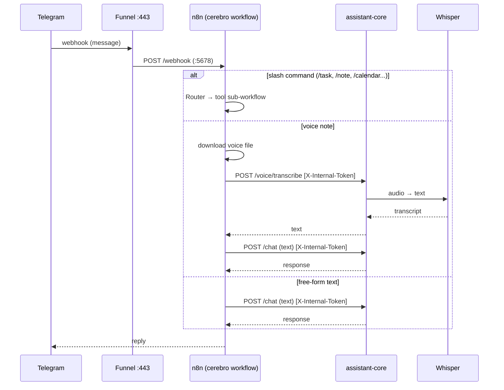
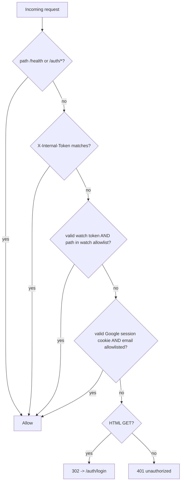
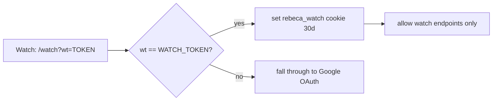
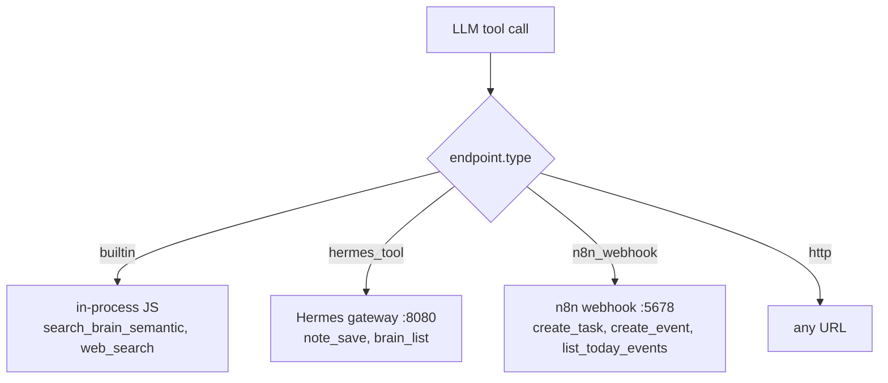
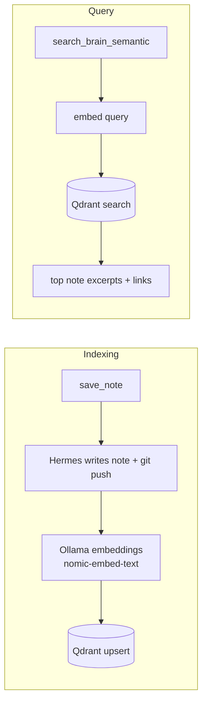
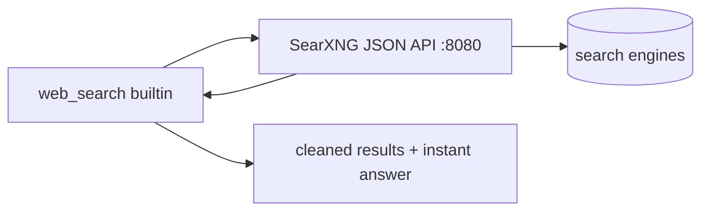

# Architecture — Rebeca / Cerebro

How the personal-assistant stack is wired today: the components, how each one
talks to the others, how it's exposed on the network, and how authentication and
authorization work. Diagrams are Mermaid (render on GitHub and most Markdown
viewers).

> Scope: the automation/assistant layer. Infrastructure (Proxmox, k3s, Tailscale
> admin, GPU provisioning) is owned separately.

---

## 1. Components at a glance

| Component | Runtime | Port | Network | Role |
|---|---|---|---|---|
| **assistant-core** | Node/Fastify | `4000` | shares `tailscale` netns | The brain: chat API, agent tool-calling loop, memory, voice proxy, auth gate. Serves the dashboard + `/watch`. |
| **n8n** | n8n | `5678` | shares `tailscale` netns | Integration hub: Telegram trigger, Router (slash-commands), tool sub-workflows (Linear, Google Calendar). |
| **Hermes gateway** | Node | `8080` | shares `tailscale` netns | Low-level tool provider: brain read/write (`note_save`, `brain_list`, `brain_graph`), fs/shell. |
| **Tailscale sidecar** | tailscale | — | `n8n_network` | Network namespace shared by the three above; publishes host ports and runs Serve/Funnel. Node name `ocra-n8n`. |
| **PostgreSQL** | postgres:16 | `5432` | `n8n_network` | n8n data + assistant-core chat sessions/messages. |
| **Qdrant** | qdrant | `6333` | `n8n_network` | Vector DB for RAG over the second brain. |
| **SearXNG** | searxng | `8080` | `n8n_network` | Self-hosted metasearch for the `web_search` tool. |
| **Ollama** | external | `11434` | tailnet (sadida) | Local LLM (fallback) + embeddings (`nomic-embed-text`). |
| **Whisper (STT)** | external | `8100` | tailnet (omarchy/sadida) | Speech-to-text. |
| **Piper (TTS)** | external | `8200` | tailnet (omarchy/sadida) | Text-to-speech. |

Clients: the **dashboard** (browser on the tailnet), the **Galaxy Watch**
(Samsung Internet over the public Funnel), and **Telegram** (text + voice notes).

### System map



Because assistant-core, n8n and Hermes **share the Tailscale container's network
namespace** (`network_mode: service:tailscale`), they reach each other on
`localhost` (`127.0.0.1:8080`, `127.0.0.1:5678`). Postgres, Qdrant and SearXNG
live on `n8n_network`; the Tailscale container is also on that network, so the
three siblings resolve them by Docker DNS name (`postgres`, `qdrant`, `searxng`).
The GPU services are reached by Tailscale MagicDNS names.

---

## 2. Network exposure (Tailscale Serve & Funnel)

Only three ports are reachable from outside the containers, all via the Tailscale
node `ocra-n8n.stegosaurus-panga.ts.net`:

| Port | Mode | Target | Who reaches it | Purpose |
|---|---|---|---|---|
| `443` | **Funnel** (public) | `127.0.0.1:5678` (n8n) | the internet | Telegram webhook (needs public reachability). |
| `8443` | **Serve** (tailnet-only) | `127.0.0.1:4000` (assistant-core) | your tailnet devices | Dashboard (full app). |
| `10000` | **Funnel** (public) | `127.0.0.1:4000` (assistant-core) | the internet | Watch access from any network. Protected by the watch token / Google OAuth. |



The whole app lives behind assistant-core, so both `:8443` and `:10000` hit the
same service; the difference is who can reach the port and which auth path applies
(see §5). HTTPS is terminated by Tailscale (valid `ts.net` cert), which also means
the browser mic (`getUserMedia`, secure-context only) works on both.

---

## 3. Request flow — dashboard chat



The LLM adapter (`llm.js`) uses **Anthropic (Claude) as primary and Ollama on
sadida as fallback**. Tool calls are dispatched by type (§6).

---

## 4. Request flow — Telegram (text + voice)



n8n calls into assistant-core with the **`X-Internal-Token`** header, which
bypasses the Google OAuth gate (service-to-service; see §5).

---

## 5. Authentication & authorization

assistant-core runs a single `onRequest` gate. Three mechanisms can authorize a
request; if none applies, HTML GETs are redirected to Google login and everything
else gets `401`.



### 5a. Google OAuth (dashboard)

Login uses Google OIDC, restricted to an allowlist (`ALLOWED_GOOGLE_EMAILS`). A
signed, http-only cookie (`rebeca_session`, 7 days) carries the authenticated
email.

```mermaid
sequenceDiagram
  participant B as Browser
  participant AC as assistant-core
  participant G as Google OAuth
  B->>AC: GET / (no valid session)
  AC-->>B: 302 /auth/login
  B->>AC: GET /auth/login
  AC->>AC: set signed state cookie
  AC-->>B: 302 to Google consent
  B->>G: sign in + consent
  G-->>B: 302 /auth/callback?code&state
  B->>AC: GET /auth/callback
  AC->>AC: verify state cookie
  AC->>G: exchange code for tokens
  G-->>AC: id_token (email)
  AC->>AC: check email against allowlist
  AC-->>B: set rebeca_session cookie, 302 /
```



The OAuth **redirect URI is `https://ocra-n8n.stegosaurus-panga.ts.net:8443/auth/callback`**
(the tailnet Serve address). This is why the watch, which is off-tailnet, cannot
complete the Google flow and instead uses the watch token below.

### 5b. Internal token (service-to-service)

n8n/Telegram flows send `X-Internal-Token: <INTERNAL_TOKEN>`. A match bypasses the
OAuth gate entirely. Used for `POST /chat`, `/voice/transcribe`, and the brain
index hooks. The token is a shared secret in `.env`, never in workflow JSON.

### 5c. Watch token (`/watch`)

The Galaxy Watch opens `…:10000/watch?wt=<WATCH_TOKEN>`. The gate sets a signed
cookie (`rebeca_watch`, 30 days) and authorizes **only** the watch endpoints:
`/watch`, `/watch.html`, `/chat`, `/chat/stream`, `/voice/*`. Any other path still
requires Google OAuth, so a leaked watch token cannot open the full dashboard.



---

## 6. Tool dispatch

Every capability is a descriptor in `tools.manifest.json` (bind-mounted +
hot-reloaded). assistant-core turns each into an LLM function definition and
dispatches calls by `endpoint.type`:



Current tools: `create_task`, `create_event`, `list_today_events` (n8n) ·
`save_note`, `search_brain` (Hermes) · `search_brain_semantic`, `web_search`
(builtin). Adding a tool is documented in [ADDING_A_TOOL.md](./ADDING_A_TOOL.md).

---

## 7. Data & knowledge flows

### RAG (second-brain semantic memory)



Saving a note auto-indexes it into Qdrant (incremental), so semantic search stays
fresh without a manual reindex. `POST /brain/reindex` rebuilds the whole
collection.

### Web search



---

## 8. Persistence

| Store | Holds | Notes |
|---|---|---|
| **PostgreSQL** | `chat_session`, `chat_message` | Per-channel conversation memory; migration retries on cold boot. |
| **Qdrant** | `brain` collection (vectors) | RAG over the vault; 768-dim (`nomic-embed-text`). |
| **Second brain (git)** | Markdown vault | Written by Hermes `note_save`, pushed to GitHub. |
| **`.env`** | secrets | OAuth, internal token, watch token, DB password, TS authkey. Never committed. |
| **Tailscale state volume** | Serve/Funnel config, node identity | Survives restarts. |

---

## 9. Client channels summary

| Channel | Entry | Auth | Voice |
|---|---|---|---|
| Dashboard | Serve `:8443` (tailnet) | Google OAuth | mic push-to-talk + TTS |
| Watch | Funnel `:10000` (public) | Watch token | mic push-to-talk + TTS |
| Telegram | Funnel `:443` → n8n | Internal token | voice notes in; text out |
```
