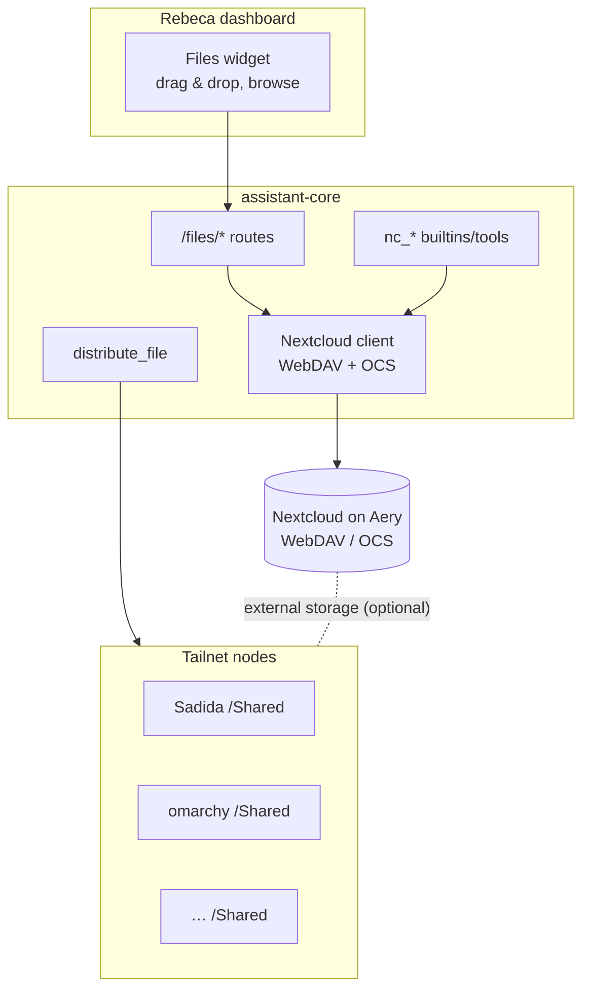

# Files & distribution — Nextcloud + Rebeca (plan)

Goal: a file/directory manager for Rebeca on top of **Nextcloud (hosted on Aery)** —
browse, drag & drop, manage (move/rename/delete), share, check storage — plus
**distribute files to `Shared/` folders on other Tailnet nodes** (send, modify,
delete in a specific directory). Related: [[Rebeca - Architecture]],
`docs/ARCHITECTURE.md`.

## Verdict: use Nextcloud, don't build our own

Nextcloud already provides, mature and battle-tested: drag & drop with **chunked
upload** for large files, folder management, versioning, trash, permissions, share
links, and clean APIs — **WebDAV** for files (`/remote.php/dav/files/<user>/`) and
**OCS** for sharing/users/quota. n8n also ships a native **Nextcloud node**.
Rebuilding this ourselves would reinvent years of work. So: **Nextcloud is the store
+ manager; we build the Rebeca integration + the node-distribution piece.**

## Scope (decided)

- ✅ Dashboard **files widget** (browse, drag & drop upload, download, move, delete).
- ✅ Rebeca **chat/voice tools** (upload/move/share/search/storage).
- ✅ **Distribute** files to other Tailnet nodes' `Shared/` dir (send, modify, delete).
- ❌ (not now) RAG Q&A over Nextcloud docs — easy to add later (reuses the current
  RAG), out of this scope.

Boundary: standing up Nextcloud and the storage backend is **infra** (owned
separately); Nextcloud on Aery is **already installed**. This plan builds the
**assistant layer** (Rebeca ↔ Nextcloud) and the **distribution mechanism**.

## Architecture

- **assistant-core** gets a small **Nextcloud client** (WebDAV + OCS) used by both
  the widget routes and the chat tools, so credentials stay server-side (no CORS,
  no secrets in the browser). Nextcloud app-password in `.env`.
- **Distribution** to nodes is a separate mechanism (see Part 2).

## Part 1 — Rebeca ↔ Nextcloud (widget + tools)

### assistant-core Nextcloud client
Config: `NEXTCLOUD_URL` (Aery, tailnet), `NEXTCLOUD_USER`, `NEXTCLOUD_APP_PASSWORD`
(create an app password in Nextcloud, not the main password). WebDAV base:
`${NEXTCLOUD_URL}/remote.php/dav/files/${NEXTCLOUD_USER}/`.

### New routes (behind the auth gate, like the other widgets)
| Route | WebDAV/OCS |
|---|---|
| `GET /files/list?path=` | PROPFIND (folder listing: name, size, mtime, type) |
| `POST /files/upload?path=` | PUT (chunked for big files via `/dav/uploads/`) |
| `GET /files/download?path=` | GET (stream) |
| `POST /files/mkdir` | MKCOL |
| `POST /files/move` | MOVE (rename/move) |
| `POST /files/delete` | DELETE (→ Nextcloud trash) |
| `POST /files/share` | OCS Share API → public/link or user share |
| `GET /files/storage` | OCS quota (used/total) |

### Dashboard files widget
A card (or a modal like the task manager) with: breadcrumb navigation, a file/folder
list, **drag & drop upload zone**, and per-item actions (download, move, delete,
share, "send to node…"). Talks only to `/files/*`.

### Rebeca tools (manifest, category "Archivos")
- `list_files(path)` · `upload_file` (from a URL or a note) · `move_file(src,dst)` ·
  `delete_file(path)` · `create_folder(path)` · `share_file(path)` ·
  `storage_usage()` · `distribute_file(path, node, dest?)` (Part 2).
- Backed by the Nextcloud client (builtins) or the **n8n Nextcloud node** — both are
  fine; builtins keep it in one place, the n8n node is faster to wire. Recommend
  builtins reusing the assistant-core client.

## Part 2 — Distribute files to Tailnet nodes

Requirement: send a file to another node's `Shared/` directory, and later modify or
delete it there. Three ways, from least to most custom:

### Option A — Nextcloud External Storage (recommended to try first)
Mount each node's `Shared/` folder into Nextcloud via **SFTP** (or SMB) as an
External Storage. Then "distribute" = **copy/move the file into that mounted folder**
(from the widget, a tool, or the Nextcloud UI); modify/delete propagate to the node.
- Pros: **zero custom code** for transfer; uniform with the rest of the files UI;
  modify/delete "just work"; reuses Nextcloud auth.
- Cons: needs SFTP/SMB reachable on each node (over the tailnet); External Storage
  has known limits (Nextcloud *sharing* and quotas don't apply to those mounts — not
  needed here since it's pure transfer).
- Fit: best if the nodes can run an SSH/SFTP server (most Linux nodes already do).

### Option B — SwapFile node agent (your project)
A tiny per-node service (**SwapFile**, `SethSterling22/SwapFile`) that exposes a small
**tailnet-only, token-protected REST API** scoped to that node's `Shared/` dir:
- `GET /files` (list), `PUT /files/<name>` (upload/modify), `GET /files/<name>`
  (download), `DELETE /files/<name>` (delete) — all sandboxed to `Shared/`.
- Rebeca's `distribute_file` calls `https://<node>.<tailnet>:<port>/files/...` with a
  shared token; the node writes into `Shared/`.
- Pros: purpose-built, works on nodes without SFTP, clean contract, easy to secure
  with a token + tailnet; you already started it.
- Cons: a service to run/maintain on each node; we finish + harden SwapFile.
- Fit: nodes where you don't want SFTP, or want an auditable API. (I couldn't read
  the repo — it's private — so this assumes SwapFile becomes that receiver; adjust to
  what it already does.)

### Option C — SSH/rsync from Hermes
Hermes already has an (off-by-default) SSH capability. Enable it with a read/write
key and `distribute_file` runs `scp`/`rsync` to `<node>:~/Shared/`.
- Pros: no per-node service; standard tooling.
- Cons: broadens Hermes' SSH surface; less sandboxed than a scoped agent.

### Recommendation
Start with **Option A (External Storage/SFTP)** if the target nodes run SSH — it's the
least code and integrates natively. Use **SwapFile (Option B)** for nodes without SFTP
or where you want the scoped REST agent; expose the API above and Rebeca's
`distribute_file` targets it. Keep **Option C** as a quick fallback via Hermes.

The **contract** either way: every node has a `Shared/` directory (the only writable
target), a node registry (name → tailnet host → transport), and Rebeca picks the node
+ destination path.

## Security

- Nextcloud: use an **app password**, tailnet-only URL, stored in `.env`.
- Node agents (SwapFile): **tailnet-only** + shared token (`X-Node-Token`), path
  sandboxed to `Shared/` (reject `..`), size limits.
- External Storage/SSH: dedicated key, restricted to the `Shared/` path where possible.
- All new assistant-core `/files/*` routes sit behind the existing Google-OAuth gate;
  Rebeca tool calls use the internal token like the rest.

## Phased plan

1. **Nextcloud client + read-only widget** — `/files/list`, `/files/download`,
   `/files/storage`; widget browse + download. Validate WebDAV/app-password.
2. **Write ops** — upload (drag & drop, chunked), mkdir, move, delete; widget actions.
3. **Sharing** — `share_file` (OCS link) + widget "share".
4. **Rebeca tools** — manifest `Archivos` category (list/upload/move/delete/share/storage).
5. **Distribution** — pick A/B/C per node; node registry; `distribute_file` tool +
   widget "send to node…"; finish/harden SwapFile if we go with B.
6. (Optional later) RAG over selected Nextcloud folders.

## Open decisions

- Transport for distribution: **External Storage/SFTP (A)** vs **SwapFile agent (B)**
  vs **SSH via Hermes (C)** — likely A for SSH-capable nodes + B via SwapFile for the
  rest.
- Which nodes are distribution targets, and the exact `Shared/` path on each.
- Tools via assistant-core builtins vs the n8n Nextcloud node (recommend builtins).
